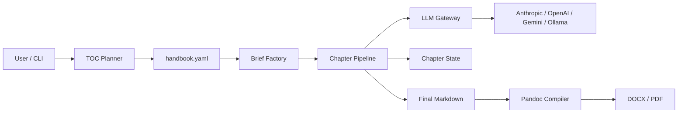

# Architecture

VyasaForge is a configurable multi-agent document production system for
long-form technical documents.

## High-Level Flow



## CLI

The CLI is implemented in `src/cli.py`. It exposes commands for:

- provider diagnostics
- handbook planning
- TOC updates
- brief generation
- chapter pipeline execution
- validation
- review and revision
- finalization
- QA
- compilation
- state and usage reporting

The primary entrypoints are:

```powershell
python -m src.cli plan-handbook --topic "Cloud Security focussing on AWS"
python -m src.cli generate-briefs
python -m src.cli run-chapters --chapters 1,2,3
python -m src.cli compile-handbook --chapters 1,2,3 --format docx
```

Installed CLI aliases are also available:

```powershell
vf plan --topic "Cloud Security focussing on AWS"
vf generate-briefs
vf run-chapters --chapters 1,2,3
vf compile-docx --chapters 1,2,3
```

## Handbook Workspaces

Each planned handbook is stored under its own workspace:

```text
handbooks/<handbook-name>/
  handbook.yaml
  chapters/
  reviews/
  reports/
  output/
  logs/
```

Global model and provider settings remain in `configs/`.

## Brief Factory

The brief factory converts registry chapter metadata into chapter execution
contracts. Briefs define:

- chapter goal
- audience
- target word count
- required sections
- must-cover topics
- examples required
- reference guidance
- quality gates

Brief files are written to the active workspace under
`chapters/briefs/chapter-NN.md`.

## Chapter Pipeline

```mermaid
flowchart LR
    Create[create-chapter] --> Write[write-chapter]
    Write --> ValidateDraft[validate drafts]
    ValidateDraft --> Repair[repair if needed]
    Repair --> ValidateDraft2[validate drafts again]
    ValidateDraft2 --> Review[review]
    Review --> Revise[revise]
    Revise --> ValidateReviewed[validate reviewed]
    ValidateReviewed --> Enhance[expert enhance]
    Enhance --> References[add references]
    References --> Finalize[finalize]
    Finalize --> ValidateFinal[validate final]
    ValidateFinal --> QA[handbook QA]
    QA --> Compile[compile DOCX/PDF]
```



The pipeline is intentionally controlled. Each agent has a defined input
contract, output contract, and validation gate.

## LLM Gateway

`src/llm_gateway.py` is the only layer that calls the configured LLM provider.
It reads model configuration from provider/config files and routes through
LiteLLM.

Design rules:

- API keys are read from environment variables only.
- Provider-specific calls must not appear in writer, reviewer, or editor logic.
- Token usage metadata is logged when providers return it.
- Prompts and API keys are not logged.

## Validator and QA

The validator performs deterministic checks such as:

- file existence
- word count
- required sections
- forbidden editorial markers
- fenced code block balance

Book-level QA checks final chapter consistency and writes a report under the
active workspace.

## Compiler

The compiler uses Pandoc for native DOCX/PDF output. It combines final Markdown
chapters, runs publish gates, and writes the compiled document under:

```text
handbooks/<handbook-name>/output/<handbook-name>.docx
```

Pandoc is required. The project does not create a lower-quality fallback DOCX
when Pandoc is missing.

## State Tracking

Chapter state is stored as JSON per chapter:

```text
handbooks/<handbook-name>/chapters/state/chapter-NN.json
```

State tracks draft, review, revision, finalization, and compilation status.

## LLM Usage Tracking

LLM usage is logged as JSONL under:

```text
handbooks/<handbook-name>/logs/llm-usage.jsonl
```

Each record includes timestamp, role, model, chapter if known, and token counts
when available.
